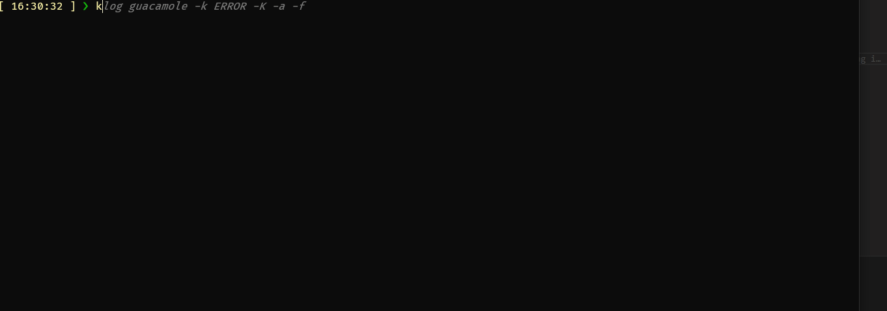

# Klog - Kubernetes Pod Logs Viewer
Klog is a command-line tool for streaming logs from Kubernetes pods. It allows you to easily view and follow logs from specific pods and containers.

## Last Build
[](https://github.com/VegaCorporoptions/klog/actions/workflows/go.yml)

## Prerequisites

Before using this application, ensure you have the following prerequisites:

- Go installed on your system (to build)
- `kubectl` configured with access to your Kubernetes cluster

## Installation (optionnal)
Clone the repository to your local machine:

```bash
git clone https://github.com/yourusername/klog
cd your-repo
```

Build the Go application:
```bash
go build .
```

## Download Klog Executable
You can download the executable for Klog directly from the latest release with its version. This allows you to use Klog without the need to build it yourself. Here are the steps to download the executable for your system:
Visit the [Releases](https://github.com/VegaCorporoptions/Klog/releases/latest) page.

## Usage
To view logs for a specific pod, run the application with the pod name as an argument:
Run the Klog application:
```yaml
Usage:
  klog [flags]

Flags:
  -c, --container string   Container name
  -h, --help               help for klog
  -k, --keyword string     Keyword for highlighting
  -l, --lastContainer      Display logs for the previous container
  -s, --sinceTime int      Show logs since N hours ago
  -T, --tailLines int      Show last N lines of logs
  -t, --timestamp          Display timestamps in logs

Examples:
  klog <pod-name> -t                    // Select containers and show logs for <pod-name> with timestamp
  klog <pod-name> -c <my-container> -l  // Show logs for <my-container> in <pod-name> for last container
  klog <pod-name> -k <my-keyword>       // Show logs for <pod-name> and color the <my-keyword> in line
  klog <pod-name> -s 24 -T 50           // Show logs for <pod-name> with sinceTime 24 hours and last 50 tailLines
```
You can select `pod` or `container` if you have multiple choices

## Demo


License
This project is licensed under the MIT License. See the LICENSE file for details.
